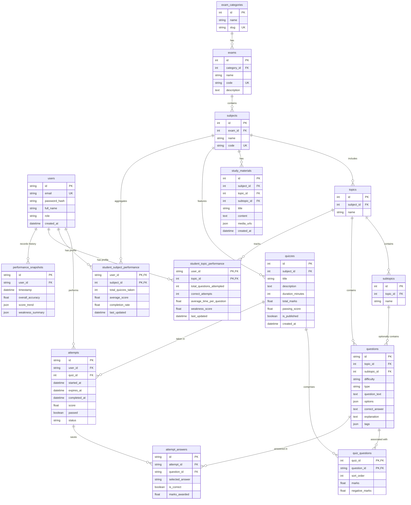

# Gandheevijaya — Database ERD & Schema Specification

This document details the normalized relational database design for **Gandheevijaya**. The design targets compatibility with local SQLite development and production PostgreSQL systems.

---

## 1. Entity Relationship Diagram (ERD)

The diagram below maps table associations, showing primary keys (PK), foreign keys (FK), and relationship cardinalities.



---

## 2. Table Specifications & Schema Definitions

### 2.1 Core Identity
#### `users`
Stores user profile credentials, hashes, and authorizations.
* `id`: `VARCHAR(36)`, Primary Key (UUIDv4)
* `email`: `VARCHAR(255)`, Unique, Indexed, Nullable=False
* `password_hash`: `VARCHAR(255)`, Nullable=False (Argon2id format)
* `full_name`: `VARCHAR(255)`, Nullable=True
* `role`: `VARCHAR(50)`, Default="STUDENT" (STUDENT, ADMIN)
* `created_at`: `TIMESTAMP`, Default=`utcnow()`, Nullable=False

---

### 2.2 Taxonomy Hierarchy
#### `exam_categories`
Groupings of exams (e.g. engineering, banking, SSC).
* `id`: `INTEGER`, Primary Key, Autoincrement
* `name`: `VARCHAR(255)`, Nullable=False
* `slug`: `VARCHAR(255)`, Unique, Indexed, Nullable=False

#### `exams`
Specific exams within a category (e.g., GATE CS, SSC CGL).
* `id`: `INTEGER`, Primary Key, Autoincrement
* `category_id`: `INTEGER`, Foreign Key -> `exam_categories.id` (ON DELETE CASCADE), Nullable=False
* `name`: `VARCHAR(255)`, Nullable=False
* `code`: `VARCHAR(50)`, Unique, Indexed, Nullable=False (e.g., GATE_CS, SSC_CGL)
* `description`: `TEXT`, Nullable=True

#### `subjects`
Curriculum topics mapped under a specific exam (e.g. C Programming, Algorithms).
* `id`: `INTEGER`, Primary Key, Autoincrement
* `exam_id`: `INTEGER`, Foreign Key -> `exams.id` (ON DELETE CASCADE), Nullable=False
* `name`: `VARCHAR(255)`, Nullable=False
* `code`: `VARCHAR(50)`, Unique, Indexed, Nullable=False (e.g. CPROG, DSA, BA)

#### `topics`
Chapters or domains inside a subject (e.g. Pointers, Trees).
* `id`: `INTEGER`, Primary Key, Autoincrement
* `subject_id`: `INTEGER`, Foreign Key -> `subjects.id` (ON DELETE CASCADE), Nullable=False
* `name`: `VARCHAR(255)`, Nullable=False

#### `subtopics`
Sub-concepts inside a chapter (e.g. Pointer Arithmetic, Binary Trees).
* `id`: `INTEGER`, Primary Key, Autoincrement
* `topic_id`: `INTEGER`, Foreign Key -> `topics.id` (ON DELETE CASCADE), Nullable=False
* `name`: `VARCHAR(255)`, Nullable=False

---

### 2.3 Course Material
#### `study_materials`
Revision modules, articles, or resources mapped to the curriculum nodes.
* `id`: `INTEGER`, Primary Key, Autoincrement
* `subject_id`: `INTEGER`, Foreign Key -> `subjects.id` (ON DELETE CASCADE), Nullable=False
* `topic_id`: `INTEGER`, Foreign Key -> `topics.id` (ON DELETE SET NULL), Nullable=True
* `subtopic_id`: `INTEGER`, Foreign Key -> `subtopics.id` (ON DELETE SET NULL), Nullable=True
* `title`: `VARCHAR(255)`, Nullable=False
* `content`: `TEXT`, Nullable=False (Supports Markdown syntax)
* `media_urls`: `JSON`, Nullable=True (Array of image or PDF asset attachment links)
* `created_at`: `TIMESTAMP`, Default=`utcnow()`, Nullable=False

---

### 2.4 Questions Base
#### `questions`
Pool of assessment questions loaded via JSON ETL ingestion.
* `id`: `VARCHAR(100)`, Primary Key (Ingested code e.g. `GCS27-PDS-E-MCQ-026`)
* `topic_id`: `INTEGER`, Foreign Key -> `topics.id` (ON DELETE CASCADE), Nullable=False
* `subtopic_id`: `INTEGER`, Foreign Key -> `subtopics.id` (ON DELETE SET NULL), Nullable=True
* `difficulty`: `VARCHAR(50)`, Nullable=False (easy, medium, hard)
* `type`: `VARCHAR(50)`, Nullable=False (MCQ, MSQ, NAT)
* `question_text`: `TEXT`, Nullable=False (Supports LaTeX and code block rendering)
* `options`: `JSON`, Nullable=True (Array of option strings. Null for NAT questions)
* `correct_answer`: `TEXT`, Nullable=False (Option key like "A", or array `["A","B"]` for MSQ, or value/range for NAT)
* `explanation`: `TEXT`, Nullable=False (Step-by-step resolution solution)
* `tags`: `JSON`, Nullable=True (Array of tag strings e.g. `["pointers", "recursion"]`)

---

### 2.5 Assessment Config & Lifecycle
#### `quizzes`
A test composed of multiple questions.
* `id`: `INTEGER`, Primary Key, Autoincrement
* `subject_id`: `INTEGER`, Foreign Key -> `subjects.id` (ON DELETE CASCADE), Nullable=False
* `title`: `VARCHAR(255)`, Nullable=False
* `description`: `TEXT`, Nullable=True
* `duration_minutes`: `INTEGER`, Default=30, Nullable=False
* `total_marks`: `FLOAT`, Default=0.0, Nullable=False
* `passing_score`: `FLOAT`, Default=0.0, Nullable=False
* `is_published`: `BOOLEAN`, Default=False, Nullable=False
* `created_at`: `TIMESTAMP`, Default=`utcnow()`, Nullable=False

#### `quiz_questions`
Join table mapping questions to quizzes with score metadata configurations.
* `quiz_id`: `INTEGER`, Foreign Key -> `quizzes.id` (ON DELETE CASCADE), Primary Key Component
* `question_id`: `VARCHAR(100)`, Foreign Key -> `questions.id` (ON DELETE CASCADE), Primary Key Component
* `sort_order`: `INTEGER`, Default=0, Nullable=False
* `marks`: `FLOAT`, Default=1.0, Nullable=False
* `negative_marks`: `FLOAT`, Default=0.0, Nullable=False

#### `attempts`
A student's session taking a specific quiz.
* `id`: `VARCHAR(36)`, Primary Key (UUIDv4)
* `user_id`: `VARCHAR(36)`, Foreign Key -> `users.id` (ON DELETE CASCADE), Nullable=False
* `quiz_id`: `INTEGER`, Foreign Key -> `quizzes.id` (ON DELETE CASCADE), Nullable=False
* `started_at`: `TIMESTAMP`, Default=`utcnow()`, Nullable=False
* `expires_at`: `TIMESTAMP`, Nullable=False
* `completed_at`: `TIMESTAMP`, Nullable=True
* `score`: `FLOAT`, Default=0.0, Nullable=False
* `passed`: `BOOLEAN`, Default=False, Nullable=False
* `status`: `VARCHAR(50)`, Default="STARTED" (STARTED, SUBMITTED, EXPIRED)

#### `attempt_answers`
Saved selections for every question in a user's quiz attempt session.
* `id`: `VARCHAR(36)`, Primary Key (UUIDv4)
* `attempt_id`: `VARCHAR(36)`, Foreign Key -> `attempts.id` (ON DELETE CASCADE), Nullable=False
* `question_id`: `VARCHAR(100)`, Foreign Key -> `questions.id` (ON DELETE CASCADE), Nullable=False
* `selected_answer`: `VARCHAR(255)`, Nullable=True (User selection code like "A", array representation, or string numeric input)
* `is_correct`: `BOOLEAN`, Default=False, Nullable=False
* `marks_awarded`: `FLOAT`, Default=0.0, Nullable=False

---

### 2.6 Analytical Performance Records (Data Science)
#### `student_subject_performance`
Subject-level user accuracy records for identifying weakness patterns.
* `user_id`: `VARCHAR(36)`, Foreign Key -> `users.id` (ON DELETE CASCADE), Primary Key Component
* `subject_id`: `INTEGER`, Foreign Key -> `subjects.id` (ON DELETE CASCADE), Primary Key Component
* `total_quizzes_taken`: `INTEGER`, Default=0, Nullable=False
* `average_score`: `FLOAT`, Default=0.0, Nullable=False
* `completion_rate`: `FLOAT`, Default=0.0, Nullable=False
* `last_updated`: `TIMESTAMP`, Default=`utcnow()`, Nullable=False

#### `student_topic_performance`
Granular topic-level accuracy metrics used in the weakness engine.
* `user_id`: `VARCHAR(36)`, Foreign Key -> `users.id` (ON DELETE CASCADE), Primary Key Component
* `topic_id`: `INTEGER`, Foreign Key -> `topics.id` (ON DELETE CASCADE), Primary Key Component
* `total_questions_attempted`: `INTEGER`, Default=0, Nullable=False
* `correct_attempts`: `INTEGER`, Default=0, Nullable=False
* `average_time_per_question`: `FLOAT`, Default=0.0, Nullable=False (In seconds)
* `weakness_score`: `FLOAT`, Default=0.0, Nullable=False (Calculated value $0.0 \le WI \le 1.5$)
* `last_updated`: `TIMESTAMP`, Default=`utcnow()`, Nullable=False

#### `performance_snapshots`
Time-series snapshot records for dashboard graph visualizations.
* `id`: `VARCHAR(36)`, Primary Key (UUIDv4)
* `user_id`: `VARCHAR(36)`, Foreign Key -> `users.id` (ON DELETE CASCADE), Nullable=False
* `timestamp`: `TIMESTAMP`, Default=`utcnow()`, Nullable=False
* `overall_accuracy`: `FLOAT`, Nullable=False
* `score_trend`: `JSON`, Nullable=True (Array list of float score histories)
* `weakness_summary`: `JSON`, Nullable=True (Object payload mapping weak topics to stats)

---

## 3. Database Migration Strategy

To support dynamic local and production configurations, we leverage Alembic version tracking:

1. **Alembic Configuration (`alembic.ini`)**: Configured with a variable target `sqlalchemy.url` driven programmatically inside `migrations/env.py`.
2. **Dynamic Migrations Handler (`env.py`)**:
   - Programmatically overrides the database connection target using the environment config `DATABASE_URL` (SQLite file URL locally, and Postgres connection string in staging/production).
   - Resolves SQLite-specific DDL limitations (e.g. dropping columns or altering constraints on older SQLite installations) by enabling `render_as_batch=True` on the migration context:
     ```python
     with context.begin_transaction():
         context.run_migrations(render_as_batch=True)
     ```
3. **Execution Commands**:
   - Generate migration files: `alembic revision --autogenerate -m "description"`
   - Upgrade database target: `alembic upgrade head`
   - Rollback migration: `alembic downgrade -1`
