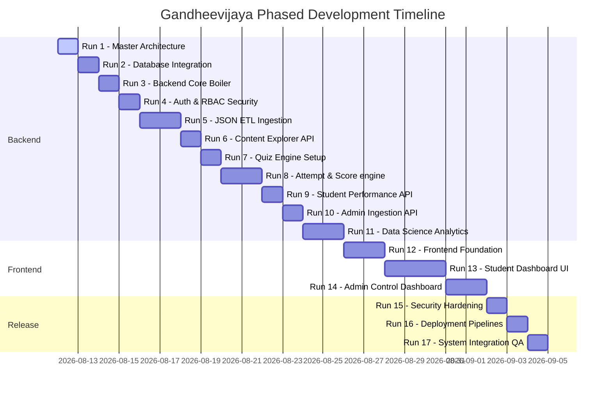

# Gandheevijaya — Development Roadmap & Implementation Phasing

This document establishes the phased implementation strategy for the **Gandheevijaya** multi-exam preparation and online assessment platform. The development roadmap is split into 17 sequential execution runs, ensuring a steady, vertical-slice progression from documentation to production release.

---

## The 17 Phased Implementation Runs

---

### RUN 1: Master Architecture (Current)
* **Goal**: Establish technical design documents and specifications for database schema, API contracts, security strategies, ETL processes, and user-facing dashboards.
* **Deliverables**:
  - `docs/master_architecture.md`
  - `docs/database_schema.md`
  - `docs/api_contract.md`
  - `docs/roadmap_and_development.md`
  - `README.md`
* **Definition of Done**: Documentation suite created, validated for consistency, and approved.

---

### RUN 2: Database Setup
* **Goal**: Implement physical relational database schema configurations matching the specification.
* **Tasks**:
  - Model mapping configurations in SQLAlchemy for all tables (adding study materials and analytics logs).
  - Configure Alembic migrations.
  - Setup environment variable triggers for SQLite (local) vs PostgreSQL (production) compilation.
* **Definition of Done**: Initial alembic migration files generated; database tables created successfully on database engines.

---

### RUN 3: Backend Foundation
* **Goal**: Setup the core FastAPI boilerplates and folder structures.
* **Tasks**:
  - Configure Pydantic config settings mapping environmental keys.
  - Setup core database engine utilities, session local middleware, and custom exceptions.
  - Initialize routers and standard health/liveness endpoints.
* **Definition of Done**: Backend server launches without errors (`uvicorn backend.app.main:app`) and response payload is returned from `/health`.

---

### RUN 4: Authentication & RBAC Security
* **Goal**: Implement identity management and route authorization.
* **Tasks**:
  - Create user creation logic with Argon2id password hash generation.
  - Write JWT token generation, signature validation, and extraction helper utilities.
  - Implement `/auth/register`, `/auth/login`, and `/auth/refresh` endpoints.
  - Define roles (`STUDENT`, `ADMIN`) and write RBAC middleware dependencies.
* **Definition of Done**: User creation, login checks, token generation, and role checks pass local test scripts.

---

### RUN 5: JSON ETL Ingestion Pipeline
* **Goal**: Build the data parser pipeline.
* **Tasks**:
  - Write filesystem walkers reading question files (`*q.json`), answer files (`*a.json`), and solution files (`*s.json`) matching their IDs.
  - Implement JSON schema validations.
  - Write double-ingestion prevention checks (idempotent UPSERT commands).
  - Produce formatted execution reports detailing success, updates, skips, and errors.
* **Definition of Done**: Loading JSON dataset compiles without creating duplicates in database.

---

### RUN 6: Exam & Content Explorer APIs
* **Goal**: Enable students to discover subjects and study materials.
* **Tasks**:
  - Create endpoints mapping exam catalogs: categories, subjects, and topics.
  - Add query filters to retrieve study materials.
* **Definition of Done**: GET `/api/v1/exams`, `/api/v1/exams/{code}/subjects`, `/api/v1/subjects/{code}/topics`, and `/api/v1/materials` return valid data arrays.

---

### RUN 7: Quiz Engine Setup
* **Goal**: Build administration interfaces for quiz creation.
* **Tasks**:
  - Implement quiz creation database schemas.
  - Implement question query selection logic and sort orders.
  - Write quiz list configurations with status checks (only administrators see unpublished drafts).
* **Definition of Done**: Administrators can configure and publish quizzes; students can list active published quizzes.

---

### RUN 8: Attempt & Score Engine
* **Goal**: Implement interactive test lifecycle actions.
* **Tasks**:
  - Create `/attempts` POST endpoint generating timed sessions.
  - Remove correct answers and explanations from quiz question response payloads.
  - Implement answer checkpoint endpoints storing student choices.
  - Write submit logic checking deadlines, scoring correctness, checking negative marking rules, and recording attempt outcomes.
* **Definition of Done**: Attempt creation starts a secure timer; intermediate saves are stored; final submissions return accurate scores.

---

### RUN 9: Student Backend Extensions
* **Goal**: Implement history logs, solution reviews, and ranks.
* **Tasks**:
  - Create attempt history logs endpoints showing past scores.
  - Write solution review endpoints (accessible only after quiz submission).
  - Implement leaderboard query aggregations.
* **Definition of Done**: Leaderboards display top users; students can retrieve detailed past attempts and explanations.

---

### RUN 10: Admin Backend Control
* **Goal**: Implement control endpoints for administrators.
* **Tasks**:
  - Build endpoints to list all active attempts.
  - Add routes to invoke JSON ingestion triggers dynamically.
  - Create admin user control endpoints.
* **Definition of Done**: Admin endpoints allow listing user histories and running directory ingestion scripts.

---

### RUN 11: Data Science Analytics
* **Goal**: Implement the weakness analysis and learning recommendations processor.
* **Tasks**:
  - Write database hooks updating subject/topic accuracy profiles when attempts are submitted.
  - Implement weakness indicator score calculations.
  - Build study material recommendation heuristics.
  - Implement snapshot generators logging accuracy over time.
* **Definition of Done**: Dashboard endpoints return accurate topic weakness logs and study recommendations.

---

### RUN 12: Frontend Foundation
* **Goal**: Initialize the client-side SPA workspace.
* **Tasks**:
  - Launch Vite project with TypeScript, React Router, Tailwind CSS, and shadcn/ui.
  - Setup Axios/Fetch clients with interceptors injecting bearer tokens.
  - Build layout templates, theme config stores, and route security.
* **Definition of Done**: Frontend workspace compiled without errors; local dev server runs; navigation switches between landing and public pages.

---

### RUN 13: Student Dashboard & Quiz UI
* **Goal**: Build the main user interface.
* **Tasks**:
  - Build registration/login forms.
  - Build exam/subject explorer and quiz lobby.
  - Design assessment screen (questions pane, status grids, floating timer).
  - Implement submission screens, past history logs, and solution reviews.
  - Add weakness metrics visualizations using charts.
* **Definition of Done**: Students can register, browse topics, start quizzes, watch timers count down, submit tests, review answers, and check stats.

---

### RUN 14: Admin Control Dashboard
* **Goal**: Build visual administration tools.
* **Tasks**:
  - Build landing page for administrators.
  - Build forms to configure quizzes and manually bind questions.
  - Build ingestion interfaces presenting import audit reports.
* **Definition of Done**: Admin user can run imports and configure quizzes via the UI.

---

### RUN 15: Testing & Security Hardening
* **Goal**: Validate stability and secure boundaries.
* **Tasks**:
  - Complete backend test suite (unit tests for scoring, database constraints).
  - Implement rate limiting middleware and security headers.
  - Verify CSRF and XSS protections.
* **Definition of Done**: Security sweeps verified; test suite returns 100% pass rate.

---

### RUN 16: Deployment Pipelines
* **Goal**: Launch live instances.
* **Tasks**:
  - Configure GitHub repository triggers.
  - Deploy frontend client to Vercel.
  - Setup backend webservice on Render; run database migrations against production PostgreSQL.
* **Definition of Done**: Live production URLs functional; CORS policies block unauthorized external domains.

---

### RUN 17: System Integration QA
* **Goal**: Final sanity validation.
* **Tasks**:
  - Run full end-to-end user flows (User sign-up -> browse subject -> start quiz -> submit -> view recommendation -> verify performance index).
  - Verify responsiveness across mobile, tablet, and desktop viewports.
* **Definition of Done**: Platform passes end-to-end workflows; final audit handbook complete.
